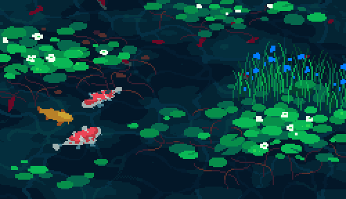

 <picture>
  <source media="(prefers-color-scheme: dark)" srcset="https://raw.githubusercontent.com/DanielsSon12/DanielsSon12/output/snake-dark.svg">
  <source media="(prefers-color-scheme: light)" srcset="https://raw.githubusercontent.com/DanielsSon12/DanielsSon12/output/snake.svg">
  
</picture>

  

  <big><strong>S</strong></big>ou estudante de Bacharelado em Sistemas de Informação no CEFET/RJ – Campus Nova Friburgo, com formação técnica integrada em Informática. Tenho conhecimentos em desenvolvimento Front-End e Back-End, com maior afinidade pelo Front-End, utilizando HTML5, CSS3, SCSS/SASS, JavaScript, React, TypeScript, Vite e Tailwind CSS. Sou uma pessoa paciente, organizada e atenta aos detalhes. Sempre gostei de arte, especialmente desenho e pintura, o que contribuiu para desenvolver um olhar visual que aplico no desenvolvimento de interfaces. Busco constantemente aprender novas tecnologias, aprimorar minhas habilidades e aplicar boas práticas de desenvolvimento. Também possuo conhecimentos em PHP, C, C++, SQL, MySQL, Git e GitHub. Atuei como estagiário na Subprefeitura do CEFET/RJ, desenvolvendo atividades administrativas e gestão de redes sociais. Atualmente, trabalho como Jovem Aprendiz na JESCRI de Friburgo Moda Íntima Ltda., como Auxiliar de Produção, mas tenho interesse e procuro um emprego na área de TI.

 

---

 

---

    

 